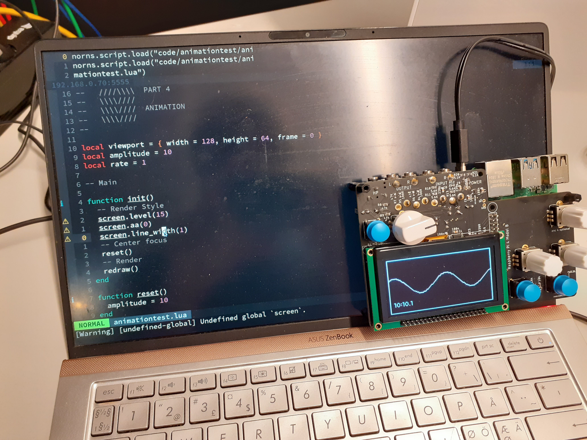

# vim-norns

A rough (and work in progress) plugin for working remotely on scripts/projects for the monome [norns platform](https://monome.org/docs/norns/). It makes use of the websocketed REPL available in [maiden](https://monome.org/docs/norns/maiden/)

Heavily inspired by  simonvanderveldt's work in atom:
https://github.com/monome/norns/issues/1067

And David Granstöm's scnvim:
github.com/davidgranstrom/scnvim

## Dependencies
The plugin was made for NVIM but may work in Vim, I dunno.

Unfortunately, this plugin has a lot of dependencies:

- rlwrap
- websocat
- sshpass
- rsync

Optional:
- Fzf / vim-fzf

Fortunately, if you are on Arch Linux or Manjaro, they are easy to install using yay: 
`yay -S rlwrap websocat sshpass rsync fzf`

## Usage
See `:h norns` for information on usage

### IP
The plugin expect norns to be on your local network as `norns.local` but this can be overwritten by setting the variable `g:norns_ip` to something else, like: `let g:norns_ip="192.168.0.70"`

The plugin comes with a helper function to aid in doing this: `:NornsFind`. This will display a list of all ip addresses on your network and by choosing one of these, the variable is set.
